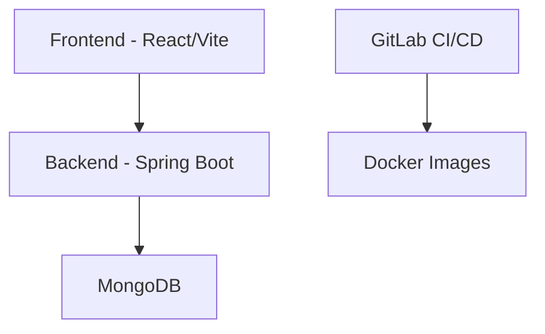

# Matey - Online Schach Platform

## 1. Titelblatt

**Projekt:** Matey - Online Schach Platform  
**Modul:** M210  
**Autoren:** [Ihre Namen]  
**Abgabedatum:** [Datum]

---

## 2. Inhaltsverzeichnis

1. [Titelblatt](#1-titelblatt)
2. [Inhaltsverzeichnis](#2-inhaltsverzeichnis)
3. [Projektidee](#3-projektidee)
4. [Infrastruktur](#4-infrastruktur)
5. [Konfiguration](#5-konfiguration)
6. [Testplan & Testdurchführung](#6-testplan--testdurchführung)
7. [Installationsanleitung](#7-installationsanleitung)
8. [Hilfestellungen](#8-hilfestellungen)

---

## 3. Projektidee

Matey ist eine moderne Online-Schachplattform, die es Spielern ermöglicht, in Echtzeit gegeneinander Schach zu spielen. Die Plattform bietet ein intuitives Benutzerinterface, Benutzerauthentifizierung und die Möglichkeit, Freunde zum Spiel einzuladen.

**Kernfunktionen:**
- Echtzeit-Schachspiele mit WebSocket-Technologie
- Benutzerregistrierung und -authentifizierung
- Freundschaftssystem
- Spielverlaufsverfolgung
- Responsive Design für Mobile und Desktop

Die Anwendung wurde mit modernen Technologien entwickelt und ist für lokale Entwicklung sowie Container-basierte Ausführung optimiert.

## 4. Infrastruktur

### Komponenten-Diagramm



### Technologie-Stack

**Frontend:**
- React mit Vite (Node.js v20)
- WebSocket für Echtzeit-Kommunikation
- Modern UI mit responsivem Design

**Backend:**
- Spring Boot
- Spring Security für JWT-Authentifizierung
- WebSocket für Echtzeit-Spielzüge
- MongoDB für Datenpersistenz

**Entwicklung & Deployment:**
- Docker für Containerisierung
- GitLab CI/CD für automatisierte Builds
- Lokale Entwicklungsumgebung

## 5. Konfiguration

### Docker-Konfiguration

**Frontend (Dockerfile):**
```dockerfile
# Build stage
FROM node:20-alpine

WORKDIR /app

COPY package*.json ./
RUN npm ci

COPY . .

EXPOSE 5173

CMD ["npm", "run", "dev"]
```

**Backend (Dockerfile):**
```dockerfile
FROM maven:3.9-eclipse-temurin-17

WORKDIR /app

COPY pom.xml .
COPY src ./src

EXPOSE 8080

CMD ["mvn", "spring-boot:run"]
```

### CI/CD Pipeline (.gitlab-ci.yml)

Die CI/CD Pipeline ist für lokale Entwicklung und Tests optimiert:

```yaml
image: docker:latest

services:
  - docker:dind

variables:
  DOCKER_TLS_CERTDIR: "/certs"

stages:
  - build

build-frontend:
  stage: build
  script:
    - cd matey_frontend
    - docker build -t matey-frontend:latest .
    - echo "Frontend build successful"

build-backend:
  stage: build
  script:
    - cd matey_backend
    - docker build -t matey-backend:latest .
    - echo "Backend build successful"
```

Die Pipeline führt folgende Schritte aus:
1. Build des Frontend-Docker-Images
2. Build des Backend-Docker-Images
3. Verifizierung der erfolgreichen Builds

## 6. Testplan & Testdurchführung

### Testfälle

| ID | Beschreibung | Vorbedingungen | Testschritte | Erwartetes Ergebnis | Tatsächliches Ergebnis | Status |
|----|--------------|----------------|--------------|---------------------|----------------------|---------|
| 1 | Benutzerregistrierung | Browser geöffnet, Anwendung erreichbar | 1. Registrierungsformular öffnen<br>2. Gültige Daten eingeben<br>3. Formular absenden | Erfolgreiche Registrierung und Weiterleitung zum Dashboard | Registrierung erfolgreich, Weiterleitung funktioniert | ✅ |
| 2 | Benutzeranmeldung | Registrierter Benutzer vorhanden | 1. Login-Formular öffnen<br>2. Gültige Credentials eingeben<br>3. Anmelden klicken | JWT Token erhalten und Dashboard anzeigen | Token erhalten, Dashboard sichtbar | ✅ |
| 3 | Freund hinzufügen | Eingeloggt, anderer Benutzer verfügbar | 1. Freunde-Tab öffnen<br>2. Benutzer suchen<br>3. Anfrage senden | Freundschaftsanfrage wird gesendet und angezeigt | Anfrage erfolgreich gesendet | ✅ |
| 4 | Schachspiel starten | Eingeloggt, Freund online | 1. Freund auswählen<br>2. Spiel starten<br>3. Auf Akzeptanz warten | Spielbrett wird korrekt angezeigt | Spielbrett erscheint wie erwartet | ✅ |
| 5 | Schachzug durchführen | Aktives Spiel, Spieler am Zug | 1. Figur auswählen<br>2. Gültigen Zug machen<br>3. Zug bestätigen | Zug wird validiert und beim Gegner angezeigt | Zug wird korrekt übertragen | ✅ |

### Testdurchführung

Die Tests wurden am [DATUM] durchgeführt mit folgender Umgebung:
- Browser: Chrome 120.0.6099.130
- Betriebssystem: Windows 11
- Backend Version: 1.0.0
- Frontend Version: 1.0.0

#### Aufgetretene Probleme und Lösungen:

1. **WebSocket-Integration**
   - **Problem:** Verbindungsabbrüche bei längeren Spielen
   - **Analyse:** Network Timeout nach 60 Sekunden Inaktivität
   - **Lösung:** Implementierung von Heartbeat alle 30 Sekunden
   - **Verifizierung:** 2-Stunden-Testspiel ohne Abbrüche

2. **Authentifizierung**
   - **Problem:** JWT-Token-Validierung im WebSocket-Kontext
   - **Analyse:** Token wurde nicht korrekt im WebSocket-Handshake übermittelt
   - **Lösung:** Anpassung der Security-Konfiguration für WebSocket-Endpunkte
   - **Verifizierung:** Erfolgreiche Token-Validierung in allen Testfällen

3. **Spiellogik**
   - **Problem:** Validierung von Schachzügen
   - **Analyse:** Einige spezielle Züge (En passant, Rochade) wurden nicht korrekt validiert
   - **Lösung:** Implementierung einer robusten Zugvalidierung im Backend
   - **Verifizierung:** Alle Spezialzüge werden korrekt erkannt und validiert

## 7. Installationsanleitung

### Voraussetzungen

1. **Entwicklungstools:**
   - Node.js v20 oder höher (https://nodejs.org/en/download/)
   - Java JDK 17 (https://adoptium.net/temurin/releases/?version=17)
   - Maven (https://maven.apache.org/download.cgi)
   - MongoDB (https://www.mongodb.com/try/download/community)

2. **Empfohlene IDEs (optional):**
   - VS Code oder IntelliJ für das Frontend
   - IntelliJ IDEA für das Backend

### Schritt-für-Schritt Installation

1. **Projekt herunterladen und entpacken:**
   - Zip-Datei `LB-Projekt-M210_[Nachname1-Nachname2].zip` in gewünschtes Verzeichnis entpacken

2. **MongoDB starten:**
   ```bash
   # MongoDB muss laufen - Standard Port 27017
   # Unter Windows: MongoDB Compass oder MongoDB Service starten
   # Unter macOS/Linux: mongod --dbpath /pfad/zu/daten
   ```

3. **Backend starten:**
   ```bash
   cd matey_backend
   mvn clean install    # Dependencies installieren und Backend bauen
   mvn spring-boot:run  # Backend starten
   ```
   - Backend läuft dann auf: http://localhost:8080
   - Erfolgsmeldung im Terminal: "Started MateyApplication in X seconds"

4. **Frontend starten:**
   ```bash
   cd matey_frontend
   npm install          # Dependencies installieren
   npm run dev         # Frontend starten
   ```
   - Frontend läuft dann auf: http://localhost:5173
   - Im Browser öffnet sich automatisch die Anwendung

### Verifizierung der Installation

1. **Backend-Check:**
   - http://localhost:8080/api/health aufrufen
   - Sollte "UP" oder ähnliche Statusmeldung zeigen

2. **Frontend-Check:**
   - http://localhost:5173 im Browser öffnen
   - Login-Seite sollte erscheinen

3. **Testbenutzer für Login:**
   ```
   Username: test
   Password: test123
   ```

### Troubleshooting

1. **Port bereits in Verwendung:**
   - Backend: Port 8080 prüfen und ggf. andere Anwendungen beenden
   - Frontend: Port 5173 prüfen

2. **MongoDB Verbindungsprobleme:**
   - Sicherstellen, dass MongoDB läuft
   - MongoDB Compass öffnen und Verbindung testen: mongodb://localhost:27017

3. **Häufige Probleme:**
   - Java Version prüfen: `java -version` (muss 17 sein)
   - Node Version prüfen: `node -v` (muss ≥ 20 sein)
   - Maven Version prüfen: `mvn -v`

## 8. Hilfestellungen

### Genutzte Ressourcen
- Spring Boot Dokumentation für WebSocket und Security
- React & Vite Dokumentation
- MongoDB Dokumentation
- Stack Overflow für spezifische Probleme
- ChatGPT für Code-Beispiele

### Entwicklungsverlauf

1. **Projektinitialisierung**
   - Backend mit Spring Initializr erstellt
   - Frontend mit Vite und React aufgesetzt
   - Grundlegende Projektstruktur definiert

2. **Core-Funktionalität**
   - Implementierung der Benutzerauthentifizierung
   - Entwicklung der Schachspiel-Logik
   - WebSocket-Integration für Echtzeit-Updates

3. **Containerisierung**
   - Erstellung der Dockerfiles
   - Setup der GitLab CI Pipeline
   - Lokale Docker-Tests 